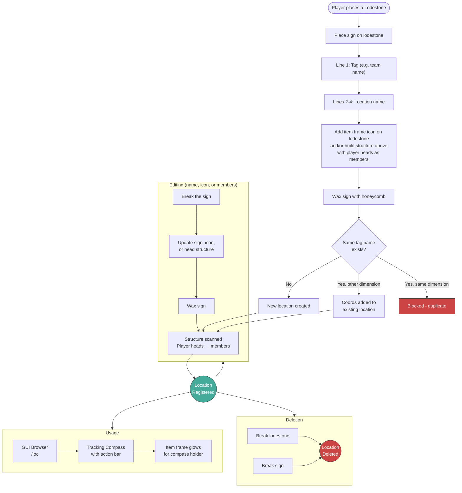
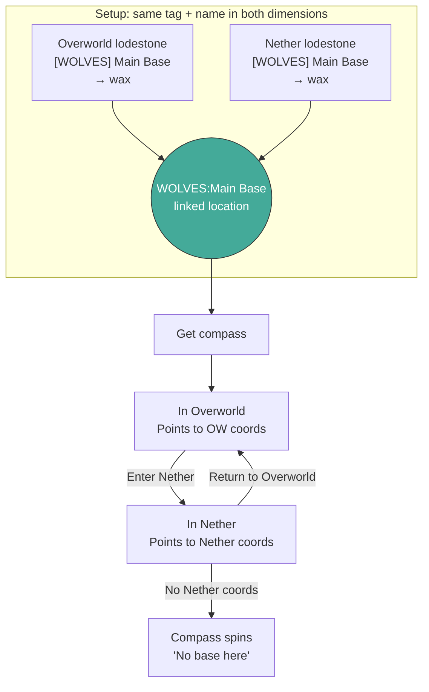

# Location Manager

A Minecraft Paper plugin for managing shared waypoints using lodestones, signs, and tracking compasses.

Players create locations by placing a sign on a lodestone and waxing it with honeycomb. Locations are visible to all players through a GUI browser and can be navigated to with tracking compasses that show distance in the action bar.

## Features

- **Lodestone + sign registration** with wax-to-confirm flow
- **Multi-dimension support** - Overworld and Nether locations linked by tag:name
- **Tracking compass** with real-time distance in action bar
- **Compass needle updates** when changing dimensions
- **Item frame icons** - use banners, player heads, or any item as location icon in the GUI
- **Per-player item frame glowing** when holding a compass (via ProtocolLib)
- **GUI browser** with pagination and filters
- **Tag system** - organize locations with custom tags
- **SQLite persistence** with multi-dimension coordinate storage

## Requirements

- Paper or Purpur 1.21+
- Java 21
- [ProtocolLib](https://github.com/dmulloy2/ProtocolLib) (optional - enables per-player item frame glowing)

## Installation

1. Download `basemanager-x.x.x.jar` from [Releases](https://github.com/paraf0x/location-manager/releases)
2. Place in your server's `plugins/` folder
3. (Optional) Install ProtocolLib for item frame glowing
4. Restart the server

## Location Lifecycle



Since signs are waxed (locked) after registration, editing requires breaking the sign to delete the location, then placing a new sign with updated details and waxing again. The lodestone and item frame can stay in place.

## Cross-Dimension Compass

Locations can span multiple dimensions. To link Overworld and Nether, register a lodestone in each dimension **using the same tag and name**. The compass then automatically switches between them:

- **In Overworld**: Compass points to the Overworld coordinates, action bar shows distance
- **Enter Nether portal**: Compass needle updates to point to the Nether coordinates
- **Return to Overworld**: Compass switches back to Overworld coordinates
- **No coords in current dimension**: Compass spins freely, action bar shows "No base here"

Auto-dispose only triggers in the **origin dimension** (where you got the compass). Walking past a Nether portal won't accidentally consume your compass.



## Icon Behavior

The location icon (displayed in the GUI) is taken from the **item frame on the lodestone at the time of waxing**. When a location spans multiple dimensions:

- The icon is set when **first registered** (first wax with an item frame)
- Waxing a second lodestone (in another dimension) with a different item frame **overwrites** the icon
- The **last waxed** lodestone's item frame wins
- If no item frame is present during waxing, the existing icon is kept

## Sign Format

```
+------------------+
| [WOLVES]         |  <- Line 1: Tag (with or without brackets, empty = "BASE")
| Main Base        |  <- Line 2: Name part 1
| North            |  <- Line 3: Name part 2 (optional)
|                  |  <- Line 4: Name part 3 (optional)
+------------------+
```

Result: Tag = `WOLVES`, Name = `Main Base North`

- Lines 2-4 are joined with spaces, empty lines ignored
- Tag is case-insensitive, stored uppercase
- Any tag is allowed (no whitelist)

## Commands

| Command | Description | Permission |
|---------|-------------|------------|
| `/loc` | Open GUI browser | `basemanager.use` (all) |
| `/loc save <tag> <name>` | Save current location | `basemanager.admin` (op) |
| `/loc delete <tag> <name>` | Delete a location | `basemanager.admin` (op) |
| `/loc compass <tag> <name>` | Get tracking compass | `basemanager.admin` (op) |
| `/loc icon <tag> <name> <material>` | Set location icon | `basemanager.admin` (op) |
| `/loc list` | List all locations | `basemanager.admin` (op) |
| `/loc reload` | Reload configuration | `basemanager.reload` (op) |

Aliases: `/base`, `/b`, `/location`

## Permissions

| Permission | Description | Default |
|------------|-------------|---------|
| `basemanager.use` | Open the location GUI | All players |
| `basemanager.admin` | Use management commands | OP |
| `basemanager.reload` | Reload configuration | OP |

## Configuration

```yaml
# Compass settings
compass:
  auto-dispose-on-arrival: true   # Remove compass when arriving
  arrival-radius: 10              # Blocks distance for arrival trigger
  show-distance-actionbar: true   # Show distance while holding compass
  actionbar-update-ticks: 20      # Update interval (20 = 1 second)

# Location limits
limits:
  max-locations-per-player: 50    # 0 = unlimited
  min-name-length: 2
  max-name-length: 32

# Database
database:
  file: storage.db                # SQLite file in plugin folder

# Lodestone registration
lodestone:
  enabled: true
  allowed-tags: []                # Empty = any tag allowed
```

## Building

```bash
# Build the plugin
./mvnw clean package

# Run tests
./mvnw test

# Full verification (compile + test + lint + spotbugs)
./mvnw clean verify
```

The built JAR is at `target/basemanager-x.x.x.jar`.
